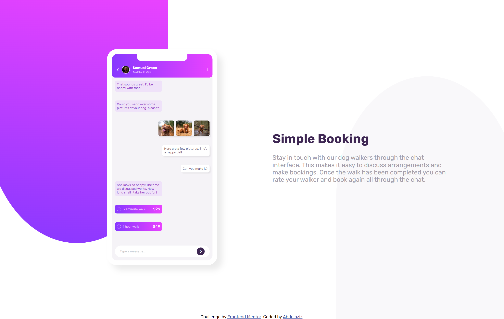
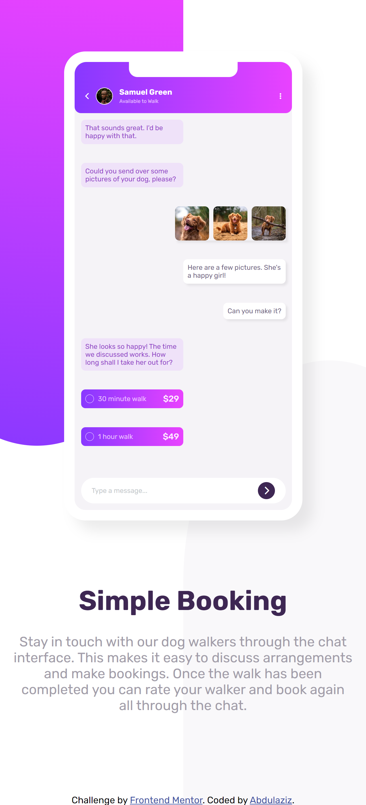

# Frontend Mentor - Chat app CSS illustration solution

This is a solution to the [Chat app CSS illustration challenge on Frontend Mentor](https://www.frontendmentor.io/challenges/chat-app-css-illustration-O5auMkFqY). Frontend Mentor challenges help you improve your coding skills by building realistic projects. 

## Overview

### The challenge

Users should be able to:

- View the optimal layout for the component depending on their device's screen size

### Screenshot

### Links

- Solution URL: [Take a look](https://your-solution-url.com)
- Live Site URL: [Take a look](https://your-live-site-url.com)

## My process

### Built with

- Semantic HTML5 markup
- CSS custom properties
- Flexbox

## Author

- Frontend Mentor - [@abdulaziz-M895](https://www.frontendmentor.io/profile/abdulaziz-M895)
- LinkedIn - [@abdulaziz-omran](https://www.linkedin.com/in/abdulaziz-omran/)